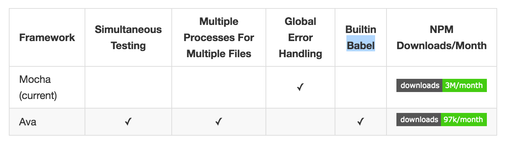

# ava-practice

## Node.js测试框架

参见 https://www.nodeguy.com/test/ ， 说的还是比较清楚的。

## ava 是什么？

未来的测试运行器

https://github.com/avajs/ava

简单的说ava是mocha的替代品，

- es6语法支持更好，对aysnc/await有支持
- 执行效率更高，使用io并发，就必须保证测试的原子性
- 语义上更简单，集众家之长

虽然 JavaScript 是单线程，但在 Node.js 里由于其异步的特性使得 IO 可以并行。AVA 利用这个优点让你的测试可以并发执行，这对于 IO 繁重的测试特别有用。另外，测试文件可以在不同的进程里并行运行，让每一个测试文件可以获得更好的性能和独立的环境。在 Pageres 项目中从 Mocha切换 到 AVA 让测试时间从 31 秒下降到 11 秒。测试并发执行强制你写原子测试，意味着测试不需要依赖全局状态或者其他测试的状态，这是一件非常好的事情。

## 历史

- 从[2014年11月19日](https://github.com/avajs/ava/commit/1089a87c2c6e5f99de8a715c41ddb074c2602404)开始，中间停了好多长时间， 2015年9月8号之后开始大量提交代码

## 为什么要用 AVA?

- 轻量和高效
- 简单的测试语法
- 并发运行测试
- 强制编写原子测试
- 没有隐藏的全局变量
- 为每个测试文件隔离环境
- 用 ES2015 编写测试
- 支持 Promise
- 支持 Generator
- 支持 Async
- 支持 Observable
- 强化断言信息
- 可选的 TAP 输出显示
- 简明的堆栈跟踪

## AVS VS Mocha 



[origin](https://github.com/koajs/koa/issues/703)

其实tj也蛮喜欢ava的


## 断言

ava支持的断言都比较简单，总体来说是抄自tap和tape，除了[plan方法](https://github.com/avajs/ava#assertion-planning)外。


- .pass([message])

Passing assertion.

- .fail([message])

Failing assertion.

- .truthy(value, [message])

Assert that value is truthy.

- .falsy(value, [message])

Assert that value is falsy.

- .true(value, [message])

Assert that value is true.

- .false(value, [message])

Assert that value is false.

- .is(value, expected, [message])

Assert that value is equal to expected.

- .not(value, expected, [message])

Assert that value is not equal to expected.

- .deepEqual(value, expected, [message])

Assert that value is deep equal to expected.

- .notDeepEqual(value, expected, [message])

Assert that value is not deep equal to expected.

- .throws(function|promise, [error, [message]])

Assert that function throws an error, or promise rejects with an error.

error can be a constructor, regex, error message or validation function.

Returns the error thrown by function or the rejection reason of promise.

- .notThrows(function|promise, [message])

Assert that function doesn't throw an error or promise resolves.

- .regex(contents, regex, [message])

Assert that contents matches regex.

- .ifError(error, [message])

Assert that error is falsy.

## 自定义断言

使用node.js sdk里默认的assert

```
import assert from 'assert';

test(t => {
    assert(true);
});
```

使用[chai](http://chaijs.com/)断言库，支持3种风格

```
import test from 'ava';

var assert = require('chai').assert;
var expect = require('chai').expect;
var should = require('chai').should();

test('expect with chai', t => {
  // typeof
  expect('test').to.be.a('string');
  expect({ foo: 'bar' }).to.be.an('object');
  expect(null).to.be.a('null');
  expect(undefined).to.be.an('undefined');
  expect(new Error).to.be.an('error');
  expect(new Float32Array()).to.be.a('float32array');
  expect(Symbol()).to.be.a('symbol');
});

test('should with chai', t => {
  var foo = 'bar'
  var tea = {
    flavors:[1,2,2]
  }
  foo.should.be.a('string');
  foo.should.equal('bar');
  foo.should.have.length(3);
  tea.should.have.property('flavors')
    .with.length(3);
});

test('assert with chai', t => {
  var foo = 'bar'
  var tea = {
    flavors:[1,2,2]
  }
  assert.typeOf(foo, 'string');
  assert.equal(foo, 'bar');
  assert.lengthOf(foo, 3)
  assert.property(tea, 'flavors');
  assert.lengthOf(tea.flavors, 3);
});
```

## hook


test方法默认是顺序执行，如果里面是顺序执行的，那么它是正常的。如果里面是异步方法呢？结果是test执行完了，而异步方法还在跑，这样的结果是，这个测试怎么跑都是正确的，因为没有走断言。。。。

演示代码如下

```
test('#register()', t => {
  // 此方法是异步的，保存需要时间
  user.save((err, u) => {
    console.log(err)
    console.log('u=' + u)
    t.true(u.password.length > 50)
  })
});
```

当test完成，user.save还没完成，结果0断言，测试结果显示成功。。。这是非常典型的例子。

最简单的回调，注意写法，`test.cb`意味着这是需要调用`t.end()`才能结束，对于测试异步方法非常好用

```
test.cb('#register()', t => {
  // 此方法是异步的，保存需要时间
  user.save((err, u) => {
    console.log(err)
    console.log('u=' + u)
    t.true(u.password.length > 50)
    t.end()
  })
});
```

- t.end() 结束异步调用，仅仅在test.cb()方法里有效


下面例子中，保证在测试save方法之前，执行完成before。也就是说，执行before等待2秒，然后再开始跑其他测试。

```
test.before.cb((t) => {
  setTimeout(() => {
    t.end();
  }, 2000);
});

test('#save()', t => {
  let user = new User({
    username: 'i5ting',
    password: '0123456789'
  });
  
  user.save((err, u) => {
    if (err) log(err)
    t.is(u.username, 'i5ting');
  });
});
```

其他cb方法可依此类推

## Control flow

- Promise
- Generator
- Async/await

### Promise 支持

If you return a promise in the test you don't need to explicitly end the test as it will end when the promise resolves.

```
test(t => {
    return somePromise().then(result => {
        t.is(result, 'unicorn');
    });
});
```
### Generator 函数支持

AVA comes with built-in support for generator functions.

```
test(function * (t) {
    const value = yield generatorFn();
    t.true(value);
});
```

具体在mongoose里的generator里使用

```
test('#save()', function * (t) {
  var u = yield User.create(user)
  t.is(u.username, 'i5ting');
});
```

测试console.log或者其他终端输出内容，推荐使用co-exec，然后将结果正则匹配就好了

```
import test from 'ava';

var exec = require('co-exec');

test('exec()', function * (t) {
    var commit = yield exec('ls -alt|grep .gitignore|wc -l');
    console.log(commit)
    t.true(commit == 1);
});

test('exec2()', function * (t) {
  var result = yield exec('ls -alt')
  
  console.log(result.trim().match(/(gitignore)/))
  
  t.true(result.trim().match(/(gitignore)/).length > 1);
  t.regex(result, /(gitignore)/);
});
```

还有一个断言t.regex,不过不太容易判断

### Async/await支持

AVA comes with built-in support for async functions (async/await).

```
test(async function (t) {
    const value = await promiseFn();
    t.true(value);
});

// async arrow function
test(async t => {
    const value = await promiseFn();
    t.true(value);
});
```

## db


### 每次连接数据库成功后，最好是dropDatabase

```
var mongoose = require("mongoose");

// 核心代码，是否开启测试
mongoose.set('debug', false);

var db = mongoose.connect("mongodb://127.0.0.1:27017/db_helloworld"); 

db.connection.on("error", function (error) {  
  console.log("数据库连接失败：" + error); 
}); 

db.connection.on("open", function () {  
  console.log("数据库连接成功");
  mongoose.connection.db.dropDatabase();
});

```


## 测试覆盖率

https://github.com/bcoe/nyc


Just install both:

```
$ npm install --save-dev nyc ava
```

They you can add this to package.json:

```
"scripts": {
  "test": "nyc ava"
}
```

集成其他badge也很简单，看它的文档即可

## http api测试

使用supertest配置express比较简单，配置koa稍微麻烦，可以使用superkoa，使用这个模块就可以普通的supertest一样了。

实例

```
var superkoa = require('superkoa')

test.cb("superkoa()", t => {
  superkoa('./koa.app.js')
    .get("/")
    .expect(200, function (err, res) {
      t.ifError(err)
      var userId = res.body.id;
      t.is(res.text, 'Hello Koa', 'res.text == Hello Koa')
      t.end()
    });
});
```

## 使用ava的开源项目推荐

找这类的项目最好是从ava开始，找贡献的相关作者，从这些作者的项目里找，基本上是十有八九。

- [pageres](https://github.com/sindresorhus/pageres/blob/master/test/test.js)
- [postcss](https://github.com/postcss/postcss/tree/master/test)
- [cssnano](https://github.com/ben-eb/cssnano/tree/master/src/__tests__)
- [postcss-discard-comments](https://github.com/ben-eb/postcss-discard-comments/blob/master/src/__tests__/index.js)
- [postcss-selector-parser](https://github.com/postcss/postcss-selector-parser/tree/master/src/__tests__)

## FAQ

### 单元测试的测试用例，总是有种无从下手的感觉，有啥好的学习方法分享？

看每个模块的测试，然后照着写就好了

越小的模块的测试看着越简单，是入门佳品

把公司的项目写的像开源项目一样，先加测试，然后加ci，一步一步来就好了。

